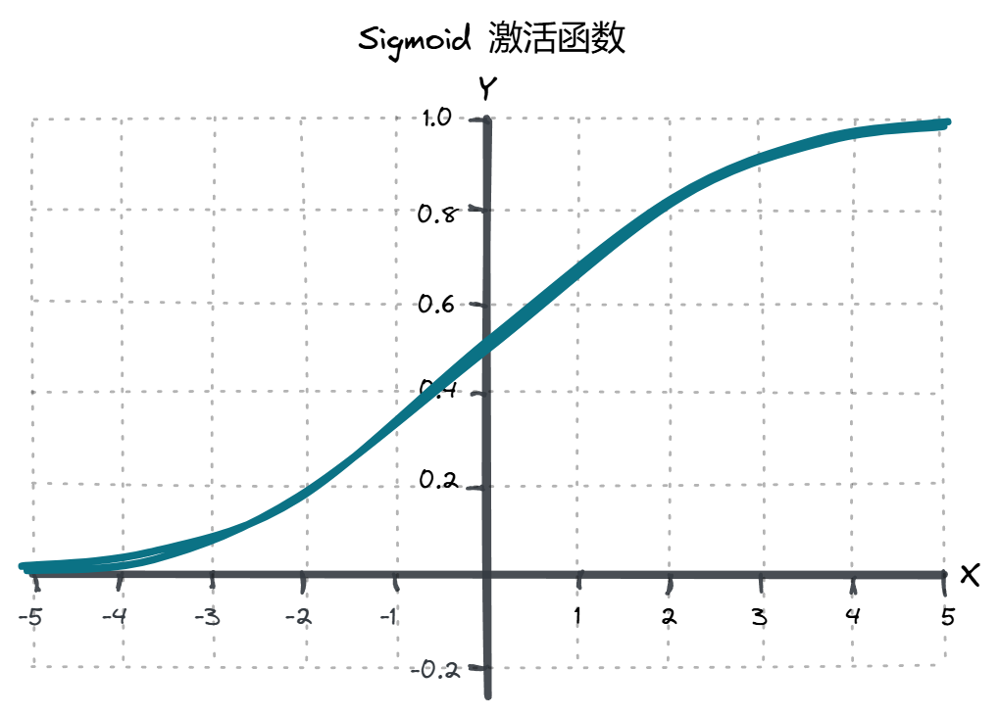

# 激活函数

## sigmond



$$
\sigma(x) = \frac{1}{1 + e^{-x}}
$$

代码实现:
```python
1 / (1 + np.exp(-z))
```

## relu

$$
f(x) = \max(0, x)
$$

代码实现:
```python
function relu(x) {
    if (x <= 0) {
        return 0;
    } else {
        return x;
    }
}
```
## 为什么要用激活函数

激活函数在神经网络中起着关键作用，主要原因包括：

### 1. 引入非线性

- 激活函数使神经网络能够学习和表示复杂的非线性关系。
- 没有激活函数，网络只能表示线性变换，无法解决复杂问题。

### 2. 增加网络的表达能力

- 通过非线性变换，网络可以拟合更复杂的函数。
- 这使得网络能够处理更复杂的数据集和任务。

### 3. 梯度传播

- 激活函数的导数用于反向传播，影响梯度的计算和更新。
- 选择合适的激活函数可以加速训练并提高收敛性。


