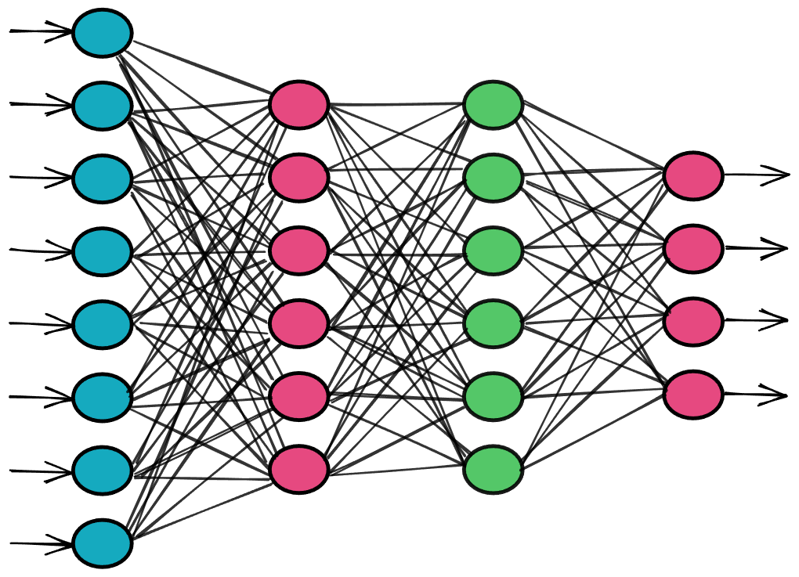

# 什么是深度学习？

## 深度学习简介

深度学习是机器学习的一个子领域，它使用受大脑神经网络结构和功能启发的算法。

- **人工神经网络 (ANN)**：深度学习中使用的神经网络并不是真正的生物神经网络，而是与生物神经网络共享一些特征的人工神经网络。

## ANN

ANN的结构：

1. **输入层**：接收外部输入的神经元构建的层。
2. **输出层**：生成最终输出的神经元构建的层。
3. **隐藏层**：位于输入层和输出层之间的层，称为隐藏层。

深度学习使用具有多个隐藏层的ANN。

## 总结

深度学习通过使用多层的ANN来模拟复杂的计算过程。随着我们继续深入学习的旅程，这一概念将变得更加清晰。
